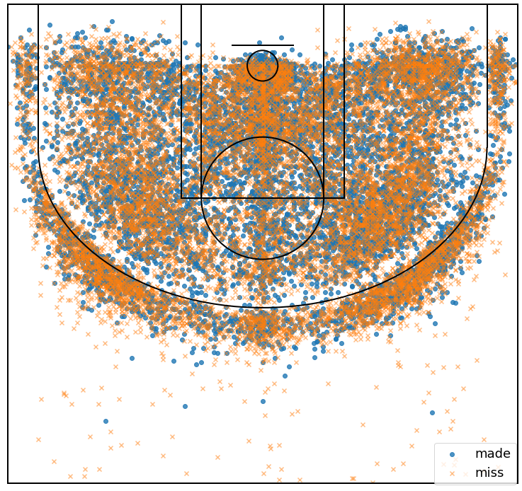

# Problem 1 (40 pts)

The file "`Game_of_Thrones_Script.csv`" contains line script for characters across 8 seasons. Use this file, answer the following question. You may need to set `keep_default_na=False` when loading the data, e.g.,

```python
import pandas as pd
pd.read_csv("Game_of_Thrones_Script.csv", keep_default_na=False)
```


## part (a) - 5 pts

How many characters are there across all 8 seasons?

```python
import pandas as pd
df1 = pd.read_csv("Game_of_Thrones_Script.csv", keep_default_na=False)
```


## part (b) - 5 pts

How many characters are there in each season?

**Note:** These numbers do not have to add to the number you get in part (a).

```python
g = df1.groupby('Season')
ncs = g.apply(lambda x: x['Name'].nunique())
print(ncs)
```


## part (c) - 5 pts

Which episode has the least number of characters?

```python
print(ncs.idxmin(), "has", ncs.min(), "characters.")
```


## part (d) - 5 pts

which episode has the most line of sentences in total?

```python
ge = df1.groupby('Episode')
n_lines = ge.apply(lambda x: x['Sentence'].shape[0])
n_lines.idxmax()
```


## part (e) - 5 pts

Across all 8 seasons, list the top 5 charaters who had the most sentences and how many sentences they have said.

```python
gn = df1.groupby('Name')
n_lines = gn.apply(lambda x: x['Sentence'].shape[0])
a = n_lines.nlargest(5)
a.index
a.values
```


## part (f) - 5 pts

For season 3, list the top 5 charaters who had the most sentences and how many sentences they have said.

```python
gn = df1[df1['Season'] == 'Season 3'].groupby('Name')
n_lines = gn.apply(lambda x: x['Sentence'].shape[0])
n_lines.nlargest(5)
```


## part (g) - 5 pts

Based on the **Sentence** column, create a new column called `num_words` which gives the total number of words in the sentence.

```python
df1['num_words'] = df1['Sentence'].apply(lambda x: len(x.split()))
```


## part (h) - 5 pts

For numeric variables, we can use some quantities to summarize. For this part, first split the data based on season. Then, for variable `num_words`, calculate

-   minimum
-   mean
-   median
-   maximum
-   summation

What can you tell based on your results?

```python
g['num_words'].agg(['min','mean','median', 'max', 'sum'])
```


# Problem 2 (30 pts)

For this problem, you are given 3 data files

-   purchases: contains purchases record March 2019 - June 2019.
-   customers: contains information about customers.
-   products: contains information about products.

First, import all 3 data files.

**Note**: When importing customers.csv and products.csv, you may want to set `index_col="customer_id"` and `index_col="product_id"`.


## part (a) - 10 pts

Using purchases as the left table, use left join to join **purchases** and **customers** together. In this case, since both tables contain column `customer_id`, so this column can be used as key for the joining. To do this, you need to set `on='customer_id'` in the `join` method. Name this joined table as **purchase1**.

Using DataFrame **purchases1**, find the frequency of purchases for different gender group.

```python
purchases = pd.read_csv("purchases.csv")
customers = pd.read_csv("customers.csv", index_col="customer_id")
products = pd.read_csv("products.csv", index_col="product_id")
purchase1 = purchases.join(customers, on='customer_id')
purchase1.groupby('gender').apply(lambda x: x['id'].count())
```


## part (b) - 10 pts

Using purchases1 as the left table, use left join to join **purchases1** and **products** together. In this case, since both tables contain column `product_id`, so this column can be used as key for the joining. To do this, you need to set `on='product_id'` in the `join` method. Name this joined table as **purchase2**.

List the top 5 best selling products (based on the **amount** sold).

```python
purchase2 = purchase1.join(products, on='product_id')
purchase2.groupby('product')['amount'].sum().nlargest(5)
```


## part (c) -10 pts

Repeat part b for each gender group: What are the top 5 best selling products for male and female group?

**Note**: One possible way to do this is to first create two new DataFrames for each gender. Then repeat what you did in part b.

```python
purchase_m = purchase2.loc[purchase2['gender']=='Male']
purchase_f = purchase2.loc[purchase2['gender']=='Female']
print(purchase_m['product'].loc[purchase_m['amount'].nlargest(5).index])
print(purchase_f['product'].loc[purchase_f['amount'].nlargest(5).index])
```


# Problem 3 (20 pts)

The file "`Kobe_data.csv`" contains shot records of NBA basketball player Kobe Bryant for his career. Below, is a function that plot all the shots made by Kobe. The graph is just to illustrate the flexibility of matplotlib.

```python
import matplotlib as mpl
import matplotlib.pyplot as plt
import pandas as pd
kobe = pd.read_csv('kobe_data.csv')
def create_court(ax, color):
    # Short corner 3PT lines
    ax.plot([-220, -220], [0, 140], linewidth=2, color=color)
    ax.plot([220, 220], [0, 140], linewidth=2, color=color)
    # 3PT Arc
    ax.add_artist(mpl.patches.Arc((0, 140), 440, 315, theta1=0, theta2=180, facecolor='none', edgecolor=color, lw=2))
    # Lane and Key
    ax.plot([-80, -80], [0, 190], linewidth=2, color=color)
    ax.plot([80, 80], [0, 190], linewidth=2, color=color)
    ax.plot([-60, -60], [0, 190], linewidth=2, color=color)
    ax.plot([60, 60], [0, 190], linewidth=2, color=color)
    ax.plot([-80, 80], [190, 190], linewidth=2, color=color)
    ax.add_artist(mpl.patches.Circle((0, 190), 60, facecolor='none', edgecolor=color, lw=2))
    # Rim
    ax.add_artist(mpl.patches.Circle((0, 60), 15, facecolor='none', edgecolor=color, lw=2))

    # Backboard
    ax.plot([-30, 30], [40, 40], linewidth=2, color=color)
    # Remove ticks
    ax.set_xticks([])
    ax.set_yticks([])

    # Set axis limits
    ax.set_xlim(-250, 250)
    ax.set_ylim(470, 0)

# General plot parameters
# mpl.rcParams['font.family'] = 'Avenir'
mpl.rcParams['font.size'] = 18
mpl.rcParams['axes.linewidth'] = 2
# Draw basketball court
fig = plt.figure(figsize=(10, 9.4))
ax = fig.add_axes([0, 0, 1, 1])
plt.scatter(kobe[kobe.shot_made_flag == 1]['loc_x'], kobe[kobe.shot_made_flag == 1]['loc_y'] + 60, alpha = 0.8, label = 'made')
plt.scatter(kobe[kobe.shot_made_flag == 0]['loc_x'], kobe[kobe.shot_made_flag == 0]['loc_y'] + 60, marker='x', alpha=0.5, label = 'miss')
ax = create_court(ax, 'black')
fig.legend(loc = 'lower right')
```




## Part (a) - 10 pts

Create a **relative** frequency table using `combined_shot_type` and `shot_zone_range` and set `margins=True`.

```python
a = pd.crosstab(kobe.combined_shot_type, kobe.shot_zone_range, margins=True)
```


## part (b) - 5 pts

As we talked during the class, this relative frequency table give the empirical probabilities associated with different categories. Based on the table, what is kobe's most commonly used shoting type?

```python
a['All'].iloc[1:6].idxmax()
```


## part (c) - 5 pts

Given a shot is made less than 8ft, what is kobe's most commonly used shoting type? What is the empirical conditional probability here?

**Hint**:

Conditional probability of A given B can be calculated by:

$$P(A|B) = \frac{P(A \cap B)}{P(B)}$$

```python
print(a['Less Than 8 ft.'].iloc[1:6].idxmax())
print(a['Less Than 8 ft.'].iloc[1:6].max() / a['Less Than 8 ft.'].loc['All'])
```